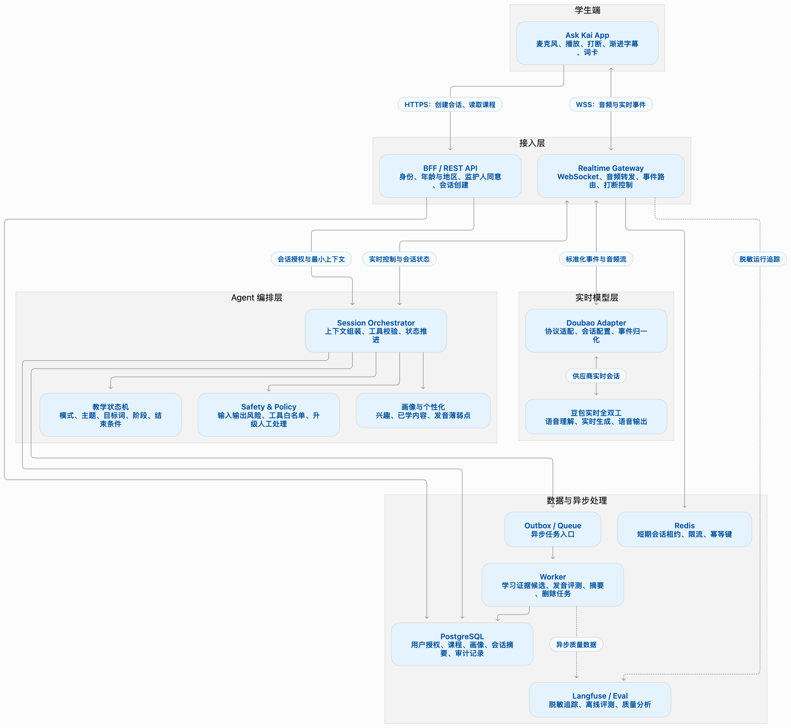
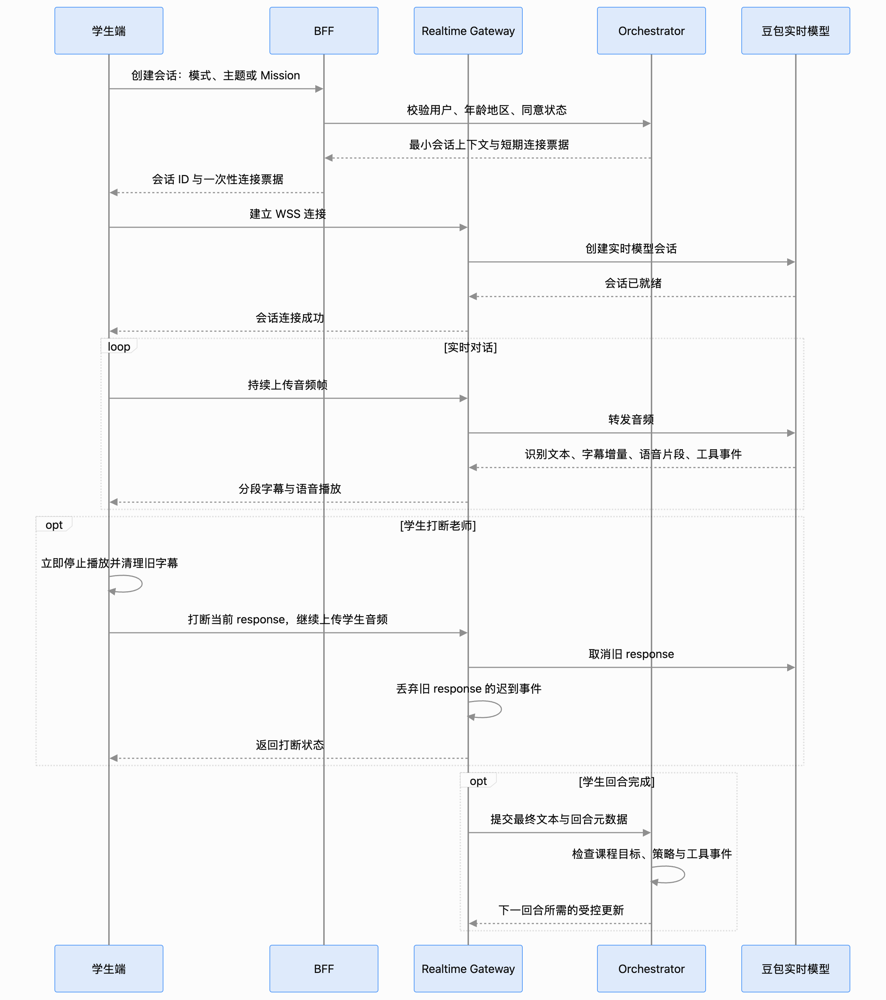
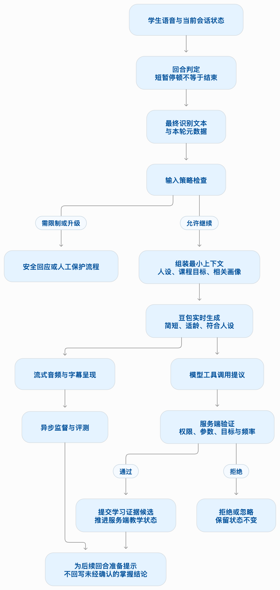
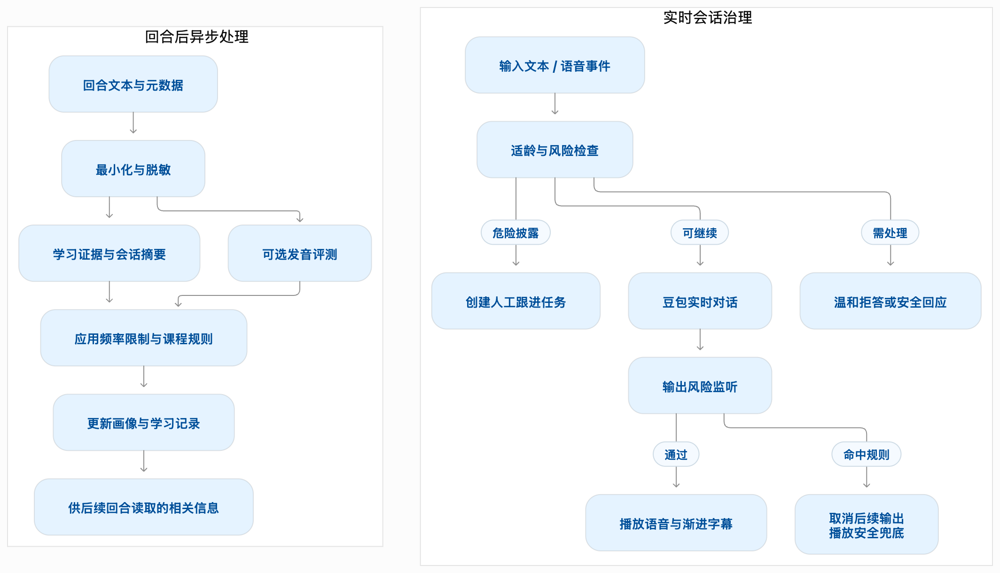

# Ask Kai Agent PRD v1.1

> 由 Ask Kai Agent PRD v1.1 Word 文档转换，供后续开发对照产品方向。当前 POC 的实施范围仍以 README.md 和 docs/implementation-plan.md 为准；二者不一致时，按现行工程边界实现，不把 PRD 中尚未落地的外部系统当成已经接入。

## 0. 写在最前面

**接入 AI 模型，不自动等于做了 Agent。**建议用一个产品和架构上都说得清的标准：

> **系统能否围绕一个目标，观察当前状态，自主选择下一步行动，并根据结果调整后续行动？**

关键是这个**决策闭环**，而不是用了多少模型、有没有语音，甚至也不一定是有没有工具调用。

| 系统表现 | 更合适的叫法 |
| --- | --- |
| 学生说一句，豆包按提示词回复一句 | 应用了 AI 服务的实时对话功能 |
| 有固定话题和预设流程，AI 负责把每一步说得自然 | AI 驱动的教学对话功能 |
| 系统知道本轮教学目标，判断学生是否已经尝试或掌握，决定继续聊、换个问法、纠音或安排复习，并更新学习状态 | 中文教学 Agent |

以“教会学生说‘我会踢足球’”为例：

- **普通 AI 功能**：学生说“我喜欢足球”，模型自然回复“你会踢足球吗？”

- **Agent**：系统发现学生还没用过“会”，选择问这个问题；学生回答后判断是否需要示范；如果学生已经会说，就推进对话；如果仍有困难，就换一个更简单的问题；结束后记录本次表现，决定以后是否复习。

两者在学生耳中都可能是一场流畅聊天，但后台承担的责任不同。

所以，对目前的设想，我会这样表述：**豆包全双工是语音对话能力；在它之上，你正在设计一个中文教学 Agent。** 只有当教学目标、对话状态、学生画像、安全规则和下一步决策真正接入运行，它才是一个已实现的 Agent。在此之前，称为“基于豆包的实时中文对话功能”更准确。

还有一个容易混淆的点：**Agent 不意味着让模型毫无约束地自主决定。** 面向未成年人的老师，恰恰应该让它只在明确的教学与安全边界内自主选择。例如，它可以决定“再给一次例子还是继续聊天”，但不能自行决定收集学生家庭信息，或把一次聊天结果当成正式的能力评定。

如果你要在 PRD 中写一句定义，建议用：

> **实时中文 Tutor Agent：以学生的交流需求和中文学习目标为依据，持续感知对话及学习状态，在安全边界内选择回应、引导、纠错与复习行动，并根据学生表现调整后续教学的语音交互系统。**

## Ask Kai Agent 详细架构图

下面按四个视角展开：**系统组件、实时会话时序、Agent 教学控制、儿童安全与评测**。核心原则是：豆包负责低延迟的听说与即时对话，Ask Kai 服务端负责课程状态、画像、工具权限和治理。

### 1. 系统组件与数据流

**两条主路径：**

- **实时语音路径：** App ⇄ Realtime Gateway ⇄ Doubao。Gateway 转发音频和实时事件，并处理打断、字幕分段与连接状态。

- **会话控制路径：** App ⇄ BFF / Orchestrator。负责年龄与地区策略、监护人同意、课程配置、画像读取、工具授权和状态持久化。

BFF 不承载音频流。首个响应前不安排另一个规划模型同步决策，以免增加对话延迟。PostgreSQL 是业务数据的事实来源；Redis 只保存短期状态，不存长期学习记录。

### 2. 实时会话时序

字幕按可读短语逐步显示，不等整段 response 全部生成后才出现。短暂停顿只作为“可能说完”的信号；不能据此关闭麦克风或结束会话。遇到配置更新，Gateway 在回合边界下发，并等待模型确认后再继续使用新配置。

关键：下一回合所需的受控更新、组装最小上下文

### 3. Agent 教学控制与状态推进

教学状态由服务端维护，可按多个独立维度记录，避免把所有逻辑塞进一个大状态枚举：

| 状态维度 | 示例 |
| --- | --- |
| 会话模式 | 开放聊天、主题对话、Mission |
| 教学进度 | 暖场、目标词引入、练习、复习、结束 |
| 学习目标 | 本课目标词、句型、达成条件 |
| 回合与输出 | 学生是否说完、老师是否仍在播放 |
| 安全状态 | 正常、需限制内容、需要人工跟进 |

豆包可提出“显示词卡”或“记录本轮练习”等工具调用，但**不能直接修改服务端状态**。Orchestrator 必须校验工具是否允许、参数是否有效、是否符合当前课程目标，再决定是否提交。掌握情况作为证据候选记录，避免把模型自己报告的结果直接当成学习结论。

### 4. 安全、画像与异步评测

安全处置应区分两种时间要求：

- **实时处置：** 对能够在播放前检测到的风险，服务端可取消后续输出并发送安全回应。已经播放到学生端的内容无法可靠撤回，因此不能承诺“所有风险都能在语音播放前拦截”。

- **人工保护流程：** 对自伤、虐待、欺凌等危险披露，Agent 应先给出适龄、支持性的回应，并按产品配置创建人工跟进任务。上线前必须有真实团队和流程接住这些任务。

- **异步个性化：** 发音评测、会话摘要和学习证据在回合后处理；结果通常影响后续回合，不插入当前语音响应的关键路径。

- **隐私数据处理：** 默认不把原始音频写入业务数据库、Redis 或普通日志。保存文本、摘要和学习证据应由地区、同意状态与留存策略共同控制；追踪与评测数据也需要脱敏。

### 5. 部署与故障边界

建议先采用模块化单体，按负载把实时网关和后台 Worker 独立部署：

网关进程崩溃时，不应假设豆包会话可以无损恢复。客户端应收到稳定错误并允许重新连接；新会话只恢复经过授权的课程状态或摘要，必要时请学生重试。地区部署、数据处理位置、供应商留存和训练用途都需要单独核实，架构图不预设这些服务承诺。

**Ask Kai**

**实时中文教学 Agent 产品需求文档**

基于豆包全双工实时语音模型的产品设计与实现要求

| **文档信息** | **内容** |
| --- | --- |
| 版本 | v1.1 需求评审稿 |
| 日期 | 2026-09-26 |
| 产品形态 | 面向中文学习者的实时语音教学 Agent |
| 主要读者 | 产品、中文教学、客户端、服务端、AI、安全与合规团队 |
| 依据 | 用户提供的两份 Ask Kai 原始需求文档、当前会话中确认的产品目标及火山引擎公开接口文档 |

**本 PRD 将 Ask Kai 定义为有教学状态、学生记忆和安全边界的实时中文教学 Agent。**豆包全双工模型承担低延迟语音理解与生成；Ask Kai 服务负责选择教学目标、推进对话、管理学习证据、调用受控能力，并处理儿童安全与数据治理。

本文用“已确认”表示用户明确提出或来源文件标注为验收要求；用“设计建议”表示为让产品可实施而补充的方案；用“待决策”表示需要产品、教学、法务或供应商确认后才能固化的事项。

## 1. 产品概述

### 1.1 产品定义

Ask Kai 是一位长期陪伴学生学习中文的 AI 老师。学生可以围绕主题、Mission 内容或自己的生活实时交谈。Kai 结合学生当前表达、学习目标和经授权保存的学习记录，选择合适的追问、中文示范、轻量纠错、发音练习或复习动作，并在会话结束时展示有证据支持的学习成果。

产品判定为 Agent 的关键，是系统具备持续的目标管理闭环：感知对话和学生状态 → 选择下一步教学动作 → 观察学生反应 → 更新学习状态 → 调整后续教学。单独连接模型并配置系统提示词，只构成 AI 对话功能，不构成本 PRD 定义的完整 Agent。

### 1.2 用户与目标

| **项目** | **定义** |
| --- | --- |
| 主要学习者 | 中文初学者，首期以 HSK Level 1 左右为核心；服务中有未满 14 岁学生，重点设计适龄体验。 |
| 典型市场 | 新加坡、泰国、英国、美国；实际上线范围需与数据处理地、供应商能力及合规评估匹配。 |
| 家长/监护人 | 在适用情况下完成授权、查看服务说明、管理学习数据及删除请求。 |
| 教师/教研 | 配置主题、教学目标、目标词句、发音指导和评测用例，审核知识内容。 |
| 产品目标 | 让学生愿意持续开口；让聊天中产生可复现的语言学习；让个性化自然、准确、适龄。 |

### 1.3 价值主张

- 把 Mission Learning → Review → Conversation → Application 连成连续学习过程。

- 由学生的回答决定追问和支架，避免固定问卷感。

- 把词汇、语法、表达和发音反馈嵌入自然对话，少讲解、多给学生说的机会。

- 会话结束时区分“听过、练过、独立使用、需要再练”，不夸大学习结果。

## 2. 需求依据与优先级

第一份原始文档给出了颜色标注规则：黄色为 Kai 人设，蓝色为共享记忆，红色为 AC 验收要求，绿色为待续事项。文档未标注部分按原说明先作为参考素材，不直接视为已批准的产品硬规则。第二份文档总结了 Ask Kai 的整体定位和五项设计原则。

| **来源内容** | **PRD 中的落点** | **优先级** |
| --- | --- | --- |
| 人格稳定；Kai 了解学生并长期陪伴中文学习 | 人格配置、记忆管理、会话连续性 | P0 |
| 画像优先用于选题与教学，不机械复述 | 学生信息最小注入、自然个性化验收 | P0 |
| 每轮只推进一个新能力；示范到独立使用逐步撤架 | 教学策略与支架等级状态 | P0 |
| 纠错只选最有价值的一点；发音反馈不得凭错误转写猜测 | 纠错策略及独立发音证据约束 | P0 |
| 课程承接、动态追问、先确认意图、明确收口 | Mission handoff、追问状态机、成果卡 | P0 |
| 年龄时长、部分主题和细节为绿色待续 | 保留为待验证实验，首版不当作强制断线规则 | P1/待定 |

## 3. 产品范围

### 3.1 首期范围（P0）

- 三种入口：Mission 后对话、主题式对话、开放式对话；共用同一 Kai 人格和学生学习状态。

- 一个首期主题包（建议体育主题），包含目标词句、可选开场、支架和回顾问题。

- 承接最近 Mission 的标题、完成状态及 1–2 项教学目标。

- 中文为主、英文作为初学者理解支架；目标句可显示汉字、拼音、英文和有限拆解。

- 学习状态与学生记忆的最小版本；支持查看、修改和删除。

- 文本字幕、目标词卡、静音/结束/打断控件、真实连接和失败状态。

- 风险监测、供应商审核配置、风险事件流程和基本运营监控。

### 3.2 后续范围（P1/P2）

- 多主题课程包、教研管理台、教师审核与版本化发布。

- 针对中文发音部位的多模态指导，包括嘴型动画、舌位和气流示意；须基于可验证评测能力。

- 跨会话间隔复习、学习报告和家长侧授权管理体验。

- 受控联网知识能力；儿童模式默认关闭通用联网和位置能力。

### 3.3 非目标

- 首期不替代完整 HSK 课程、教师评价或正式语言能力认证。

- 不将端到端语音转写直接当作可靠发音评分。

- 不承诺模型可以在所有生成时序下拦截全部不当音频。

- 不自动保存所有原始录音作为长期档案。

## 4. 核心体验与对话模式

### 4.1 共用体验原则

| **原则** | **产品行为** |
| --- | --- |
| 先理解意图 | 表达不完整或有歧义时先用一个简短问题确认，再纠正表达。 |
| 对话由学生推动 | 从学生刚才说的内容选择追问；问题库是素材，不是脚本。学生说话和思考时不抢话、不连续插入追问。 |
| 轮次边界清晰 | 以学生完整表达为一个轮次；短暂停顿不立即抢答。学生仍可随时打断 Kai，打断后清除过期播报。 |
| 回复短而可继续 | 日常回应通常 1–2 句短中文；每轮最多一个问题。教学解释优先放到词卡/字幕，不把一轮变成小讲座。 |
| 字幕逐段出现 | 字幕随语音分段呈现，不在播报开始时一次性铺满整段回复；不支持精确对齐时，明确采用短语级近似同步。 |
| 教在交流中 | 优先让学生继续表达；一次只突出一个语言目标或纠错点。 |
| 画像自然使用 | 每轮只使用少量相关信息；不说“系统显示你的资料”。 |
| 适度挑战 | 已掌握表达减少拆解；薄弱表达在自然场景复现；困难时降低问题难度。 |
| 结果有证据 | 仅总结本轮实际出现且有记录支持的练习和学生表现。 |

### 4.2 模式与控制强度

| **模式** | **教学目标强度** | **会话组织** | **退出条件** |
| --- | --- | --- | --- |
| Mission 后对话 | 中高：应用刚完成课程里的 1–2 个表达 | 认可表现 → 快速回忆/课程问答 → 逐步过渡到真实生活 | 学生结束、目标已尝试且自然收口，或需要转入安全流程 |
| 主题式对话 | 中：围绕主题设置一个词句目标 | 低门槛开场 → 回应驱动追问 → 目标表达引出 → 简短回顾 | 学生结束、主题自然结束、目标练习足够或切换主题 |
| 开放式对话 | 低：以交流为先，教学机会轻量触发 | 理解学生意图 → 自然回应 → 相关追问；适当时提供可用中文 | 学生结束或对话自然收束 |

### 4.3 标准对话回合

- 接收用户语音与当前模式、主题、目标、画像摘要。

- 识别用户主要意图及表达是否足够清楚；若含糊，优先意图确认。

- 结合学习状态选一个动作：自然回应、追问、中文示范、表达纠正、发音邀请、复习或结束。

- 生成简短、适龄的中文语音；有需要时提供英文支架和屏幕词卡。

- 记录本轮目标呈现、学生尝试、反馈和风险事件；服务端更新下一步状态。

## 5. 教学与个性化设计

### 5.1 学习目标模型

每个主题/Mission 教学目标至少包含：target_id、目标表达/词汇、适用等级、先修内容、教学意图、示范文本、可接受的学生变体、常见错误、支架级别、是否需要发音评测、成功证据、复习建议和教研版本。目标库由课程内容服务提供；完整词表不塞进 system prompt。

### 5.2 学习状态与掌握证据

| **状态** | **判定依据** | **Kai 行为** |
| --- | --- | --- |
| 未接触 | 课程/历史中无可靠记录 | 可在适当难度下示范 |
| 已呈现 | 听到或看到目标内容，尚未输出 | 不宣称掌握；可邀请轻量模仿 |
| 提示下尝试 | 在句型、选择题或示范后使用 | 保持支架，逐渐减少提示 |
| 独立使用 | 无直接复述提示，表达意图匹配 | 具体肯定，减少拆解 |
| 迁移使用 | 在新语境再次正确使用 | 可更新为掌握的有力证据 |
| 待复习 | 证据不足、连续困难或间隔后需检验 | 未来自然复现，不在当前回合强行考试 |

首期只允许系统记录“本轮练过”“在支架下说出”“独立说出”“待复习”等观察事实。掌握状态采用可追溯证据，不由模型一句工具调用直接定案。学习状态更新可以先由规则/结构化评测产生候选项，再由服务端校验和持久化。

### 5.3 错误纠正策略

| **情况** | **处理** | **示例方向** |
| --- | --- | --- |
| 妨碍理解或关键目标错误 | 先确认意图（若必要），给一个自然版本并邀请重说 | “你是说周末的计划吗？可以说……” |
| 不影响理解的小错误 | 自然重述正确表达，不展开讲课 | “哦，你昨天去了公园。” |
| 重复出现且本轮有证据 | 只反馈一个最有价值的问题 | 指出“想/喜欢”在此处的区别 |
| 多个错误并存 | 选择最影响沟通或最贴合当前目标的一项 | 暂缓其他错误进入总结/下次目标 |
| 不确定学生意思 | 问一个澄清问题，不先改写学生意图 | 给出两个可选理解供确认 |

### 5.4 中英双语与目标句格式

- 默认中文先说；初学者场景提供简短英文整句解释。语言难度较高或学生已熟练时，按学习画像减少英文支架。

- 普通句只需中文和自然英文解释，不做逐词拆解。

- 目标学习句才增加 1–4 个有教学价值的词/词组解释；一轮最多一个目标学习句。

- 长解释尽量转成屏幕词卡，避免老师连续长时间讲话。

设计建议：双语输出比例、拼音显示及词卡自动弹出都作为学生级偏好/课程配置，并通过学习效果和会话时长实验验证。

### 5.5 发音反馈

- 模型听懂与否、ASR 转写是否正确，不等于发音是否准确。不得只依据转写差异推断声母、韵母或声调错误。

- 发音评测只在目标词、学生主动请求或课程指定节点触发；采集范围限于完成评测所需音频片段，明确记录用途和留存。

- 反馈一次只聚焦一个可证实的问题；评测低置信度时请学生重说或给标准示范，不输出具体诊断。

- 舌位、嘴型、发音部位和气流指导列为后续能力，需由中文发音专家审核诊断映射。

## 6. Agent 决策与会话状态

### 6.1 优先级顺序

- 儿童安全、隐私和服务边界。

- 理解学生当前明确表达的意图及结束/打断意愿。

- 维持当前对话自然、简短、可继续。

- 满足本轮教学目标，并使用本次真实学习证据。

- 依据学生画像选题、调节难度和提供支架。

- 记录结果并为后续会话提出候选复习建议。

### 6.2 教学决策动作集

| **动作** | **使用条件** | **服务端控制** |
| --- | --- | --- |
| RESPOND | 学生意图清晰，无需显式教学 | 短回答；保留一个自然追问入口 |
| FOLLOW_UP | 学生提供了可延展信息 | 追问单点，避免连续盘问 |
| CLARIFY_INTENT | ASR/语义不明确或有多种合理解释 | 先确认，再教学；不得擅自归因 |
| TEACH_TARGET | 目标匹配、难度合适、学生愿意继续 | 每回合至多一个重点；可返回词卡元数据 |
| CORRECT_LANGUAGE | 错误妨碍交流或与本轮目标高度相关 | 最多一个表达纠错点 |
| PRONUNCIATION_SUPPORT | 有可靠音频评测/课程节点/学生请求 | 评测结果必须含目标词与置信度/可用性 |
| REVIEW | 有待复习目标且对话中出现自然机会 | 不进行生硬考试式复习 |
| CLOSE | 学生主动结束或会话自然收束 | 生成有证据的摘要；尊重立即结束 |
| SAFE_HANDOFF | 安全风险达到升级阈值 | 预设语句、事件最小记录、人工流程 |

### 6.3 状态与更新边界

会话状态至少含：conversation_mode、topic_id、mission_id、current_goal_ids、recent_user_intent、support_level、clarification_pending、turn_count、correction_cooldown、session_duration、learning_evidence、safety_state、last_update_revision。画像和历史属于低频变化的会话初始化数据；本轮目标和支架属于中频状态；麦克风/播报/打断属于高频客户端状态。三种状态不应塞进同一段不断重写的提示词。

会话更新只在安全的轮次边界或明确阶段切换时进行；等待 session.updated 确认后才依赖新配置。异步监督结果延迟到下一轮应用，不能假设可追回已开始播出的内容。

### 6.4 轮次管理与避免抢话

“减少插话”指 Kai 不频繁抢学生的话轮、不把思考停顿当成说完；不指关闭全双工或取消学生打断 Kai 的权利。系统需区分学生仍在说、短暂停顿/犹豫、话轮结束、背景噪声和学生主动打断。

- 端点检测采用可配置的静音阈值和语义端点信号；连续语音中的短停顿不触发 Kai 回复。阈值需通过低龄学习者、不同口音、网络和环境噪声实测，不在 PRD 固定未经验证的毫秒数。

- 学生尚未完成表达时，不让模型以“嗯？”“然后呢？”等填充语频繁插入；若需要帮助，等学生明确求助、长时间停顿或系统确认本轮结束后再给一个低压提示。

- 学生可在 Kai 播报期间随时插话或结束；客户端立即停止旧音频队列，忽略迟到的旧轮次音频/字幕，并恢复正确的 VAD/采集状态。

- Kai 的追问/提示应由同一轮的教学决策选择；避免同一时间多个问题、重复催促或静音后连续自动追问。沉默支持策略采用逐级提示并设置次数/冷却时间。

- 记录端点误判、重叠语音、学生打断、Kai 抢话/重复提示等事件，用真实会话评测调整模型和客户端参数。

### 6.5 回复长度与教学信息分层

- 开放聊天的一般回应默认 1–2 句短中文，并保留至多一个自然追问；主题/任务教学回合通常包含一个简短示范、至多一条解释和一个学生可回答的问题。

- 避免语音重复汉字、拼音、英文释义和长篇语法解释；语音说最必要的一层，字幕/词卡承载补充文字。

- 遇到复杂或安全相关问题可超出常规长度，但应分段说明，并在合适位置确认学生是否想继续听。

- 长度控制是目标与验收维度，不依赖未确认的 API 参数或提示词单独保证。统计发言时长、字数分布和老师/学生发言时长比；超长时在后续轮次纠偏，不能假定事后审核能撤回已播内容。

### 6.6 逐段字幕体验

保留原始转写/回复事件供会话记录使用，学生端另设字幕呈现层。字幕需像“娓娓道来”一样随 Kai 的语音逐段出现，而非在 response 开始时一次性显示整段文本。

- 优先消费可用的流式文本 delta，并按句子或短语缓冲；完成一个可读片段后再显示，避免逐字闪烁、整段突然出现或长文本挤满屏幕。

- 字幕与音频尽可能按输出事件/播放进度近似同步；若接口没有可用的文本-音频时间戳，不宣称字词级精确同步，采用短语级渐进显示并以真机试听校准。

- 每个响应维护 response_id/item_id 和轮次序号；打断、取消、重连或迟到事件时丢弃旧响应未展示字幕，不把上一轮残文混到新一轮。

- 字幕可开关、字号可调；当前发声片段易于定位；完整文本可在会话记录中查看，但不在播报开始瞬间全部塞入实时字幕区。

## 7. 豆包全双工接入要求

依据火山引擎“端到端实时语音-全双工版本”和“接入必读”公开文档。官方文档指出该版本采用新的 Realtime 事件协议；建议按具体账户权限、模型版本和协议样例实施，不与旧版 S2S 事件混用。

| **环节** | **接口/要求** | **Ask Kai 用途及实现约束** |
| --- | --- | --- |
| 连接 | WebSocket 路径：wss://openspeech.bytedance.com/api/v3/duplex/realtime/dialogue | 服务端/受信网关持有服务端凭证；客户端不暴露长期密钥。 |
| 模型会话 | session.create；model 固定为 1.2.6.1（以开通权限为准） | 每次初始化提供人格、当前模式和最小上下文。 |
| 提示词 | session.instructions；文档提示与内部 SP、上下文合计有长度上限 | 用结构化模板拼装；只放本轮目标和少量相关画像，不发送整份档案。 |
| 会话更新 | session.update / session.updated | 阶段切换、目标调整或工具集合改变；工具列表更新按文档是全量覆盖。 |
| 上行音频 | input_audio_buffer.append；单声道 16 kHz PCM/Opus；建议 20 ms 分片 | 按真实节奏发送；停止采集时正确处理静音事件；不可为消除冲突而默认暂停麦克风。 |
| 下行音频 | response.output_audio.delta；默认 Opus，可配置 PCM 24 kHz | 按增量播放并保留插话能力，管理播放队列与取消事件。 |
| 文本/字幕 | 转写与回复的 delta/completed/done 事件 | 实时字幕层按短语渐进展示；原始完整文本供记录；ASR 不能作为发音评分结论。文本事件与音频是否具备精确对齐信息以当前协议/实测为准。 |
| 函数调用 | tools；response.function_call_arguments.done；conversation.item.create 回传工具结果 | 仅暴露低风险、受限工具；校验 schema、权限与业务状态；通过 call_id 配对。 |
| 干预/打断 | speech_text_buffer.replacement.*；response.cancel | 用于预设回复/取消进行中的响应；安全拦截的实际听感和竞态须专项压测。 |
| 收尾与诊断 | session.close；error、response.done；event_id 与 X-Tt-Logid | 正常关闭；记录非敏感链路指标与错误码；5xx 才按策略有限重连。 |

重要实现约束：全双工依赖上行音频流保活。输入/输出协调应通过回声消除、播放状态、VAD/端点检测和客户端打断状态解决，不能用“老师一说话就关麦”替代问题定位。每个前端需显示真实连接状态、等待状态、可打断状态和失败后的重试/退出方式。

## 8. 系统架构与职责

| **层** | **职责** | **关键数据/接口** |
| --- | --- | --- |
| 学生端 | 麦克风/扬声器；流式播放；字幕、汉字/拼音/英文词卡；静音、结束、打断和连接状态。 | 音频帧、响应播放队列、UI 动作状态 |
| 实时会话网关 | 建立豆包 WS；转发音频/事件；维护 session 与 event_id；处理打断、错误、关闭和限流。 | session.create/update/close；audio append；delta events |
| Agent 编排服务 | 加载模式、目标、最小画像；决定何时更新目标；协调工具调用与后续监督。 | AgentState、PolicyDecision、ToolResult |
| 课程服务 | 版本化保存主题、目标词句、先修、支架、标准示范与验收规则。 | TopicPack、Lesson/Mission context |
| 学生学习服务 | 分开存个人画像、学习画像、会话摘要和学习证据；支持权利请求。 | LearnerProfile、LearningEvidence、ConsentState |
| 安全与治理 | 准入、内容分类、儿童保护流程、数据最小化、权限/审计/留存。 | PolicyResult、SafeguardingEvent、DeletionRequest |
| 异步质检 | 对转写和回复做教学质量评估；只将结果用于后续回合或运营分析。 | Langfuse/评测运行器适配、回放数据最小化 |

### 8.1 快慢路径

快速路径：学生音频 → 豆包实时理解/生成 → 学生端流式播放。该路径优先保证对话自然、插话有效和状态正确。

慢速路径：已完成回合文本/经许可的评测音频 → 质量与教学证据分析 → 服务端校验 → 更新后续目标/画像候选。任何后台结果均不得覆盖学生本轮明确表达，也不得回写未经验证的长期标签。

### 8.2 受控工具建议

| **工具名称** | **功能** | **权限/回传限制** |
| --- | --- | --- |
| get_current_lesson_context | 读取最近 Mission 和目标表达 | 只返回当前学生授权且当前会话相关的数据 |
| get_topic_options | 获取适龄且教学可用的话题候选 | 不联网；按国家/年龄/敏感度筛选 |
| show_word_card | 请求展示经课程库批准的词卡 | 仅显示课程库中的目标词，不允许模型生成任意 UI/URL |
| record_learning_evidence | 提交一次目标表达观察候选 | 服务端校验轮次、证据来源和重复记录；不直接设置 mastered=true |
| request_pronunciation_check | 提交目标词发音评测 | 需同意/课程策略允许；限定片段、用途、留存期限 |
| flag_safeguarding | 触发安全事件流程 | 最小必要信息、权限隔离、操作留痕；明确真人处理责任 |

## 9. 未成年人安全、隐私与合规

### 9.1 产品安全基线

- 清楚标注 Kai 是 AI 中文老师；不冒充真人或宣称现实生活中真实家庭关系。

- 不主动索取真实姓名、具体学校班级、住址、电话号码、社交账号、照片或实时位置。

- 学生自发披露个人信息时，不重复扩展收集；提示不要继续分享敏感细节，按产品策略处理原始数据。

- 限制成人主题、色情/性内容、自伤方法、暴力煽动、危险挑战和购买/金钱诱导。按年龄和风险设定策略。

- 出现自伤、虐待、欺凌或现实危险信号时，使用经过审查的支持性回应和本地人工升级流程；不承诺保密、不作诊断、不自动把所有事件简单通知家长。

- 设置易发现的结束、静音、打断和数据管理入口；禁止以连续追问或情感压力延长会话。

### 9.2 安全时序与兜底

由于端到端输出可流式到达，纯文本后置审核可能晚于音频播放。安全设计采用多层措施：模型指令和供应商审核、输入/输出旁路风险分类、早期 response.cancel、预审固定安全语句、需要时切换受控回复路径，以及人工接手流程。对高风险情形不以“模型已被提示”作为安全保证。

具体需验证 replacement 事件与 response.cancel 的先后关系、已下发音频缓冲如何停止、是否残留已播放内容、恢复识别需要的客户端状态以及事件竞态。最终实现以全双工版本协议和实测结果为准。

### 9.3 数据与跨境治理

| **数据类别** | **首期建议** | **需形成的治理控制** |
| --- | --- | --- |
| 原始语音 | 默认不长期保存；只在当前实时传输或用户明确授权的必要评测中使用。 | 用途、供应商处理地、加密、保留期、删除方式、是否用于模型训练。 |
| 转写与回复文本 | 只保存教学所必需的最小对话记录/学习证据；支持会话级配置。 | 儿童可读告知、权限、访问/更正/删除、导出与保留策略。 |
| 画像/标签 | 只存有明确教学用途的字段；设过期时间和证据来源。 | 标签纠正、自动过期、禁止敏感推断和广告画像。 |
| 日志/质量评测 | 默认脱敏、最小字段；生产对话进入评测需有合适的授权依据。 | 访问控制、用途限制、脱敏、删除、供应商与分包商管理。 |
| 地区与年龄 | 按服务对象和实际使用地点配置规则，不单靠用户自报年龄解决所有义务。 | 地区适用性判断、年龄保证、家长/监护人流程及法律评审。 |

上线前需逐项核实新加坡、泰国、英国和美国相关要求，尤其是儿童语音属于何种个人信息、监护人授权条件、跨境传输、供应商分包、删除和留存。火山引擎/BytePlus 对应产品实例的数据处理地点、保留方式和训练用途属于待供应商书面确认事项；本 PRD 不假设数据必定在某一地区处理。

## 10. 人格配置与提示词管理

### 10.1 配置项

| **配置区** | **字段示例** | **规则** |
| --- | --- | --- |
| 身份 | Kai 名称、AI 老师身份、核心职责 | 版本化；不允许学生请求覆盖安全和角色核心。 |
| 风格 | 耐心、幽默程度、内向/外向、说话节奏、鼓励方式 | 用正反例约束；避免仅用抽象形容词。 |
| 角色知识 | 兴趣、稳定偏好、可分享的角色故事 | 明确虚构属性；内容审核；不得临时捏造现实经历。 |
| 语音呈现 | 音色 ID、语速、语言切换习惯、音量 | 仅使用供应商已开通音色；年龄适宜性需试测。 |
| 教学风格 | 先听、再反馈；纠错力度；双语/拼音偏好 | 支持按模式/学生等级配置；日志保留配置版本。 |
| 安全不变量 | 隐私、成人话题、安全事件处理、工具权限 | 服务端策略高于用户画像和模型自我生成。 |

### 10.2 提示词装配顺序

- 固定安全和身份规则（最优先）。

- 已发布的人格版本与年龄风格。

- 本轮模式、主题、单个教学目标和纠错节奏。

- 相关学生学习画像摘要和近期证据。

- 本轮会话状态与可信的历史摘要。

画像、学生输入、课程自由文本均作为数据而非新系统指令；结构化课程字段需经过校验。超出上下文预算时，优先删减无关历史，不删安全规则和本轮目标。

## 11. 交互与功能需求

| **ID** | **需求** | **验收要点** | **优先级** |
| --- | --- | --- | --- |
| AK-UX-01 | 选择模式/主题 | 支持 Mission 承接、主题入口、开放入口；可显示 Kai 推荐并允许学生改选。 | P0 |
| AK-UX-02 | 真实连接状态 | 明确显示连接中、聆听、思考/回应、失败和结束；不得把模拟语音伪装成已连接。 | P0 |
| AK-UX-03 | 可打断 | Kai 输出期间学生可插话；打断后不继续播放过期内容，麦克风/VAD 状态保持正确。 | P0 |
| AK-UX-04 | 渐进字幕和词卡 | 回复字幕按句/短语渐进显示，不在播报开始时一次性显示整段；旧轮次字幕在打断后清除。字幕可关闭/调字号；目标词卡含汉字/拼音/英文。 | P0 |
| AK-UX-05 | 控制权 | 学生可以重说、跳过纠错、换主题、结束会话；无需说明理由。 | P0 |
| AK-UX-06 | 成果卡 | 会话后列出练习/独立使用/再练项，数据来自事件证据。 | P0 |
| AK-UX-07 | 数据管理 | 授权、说明、删除和家长入口按上线地区与法律评估实现。 | P0 上线门槛 |
| AK-UX-08 | 轮次与插话控制 | Kai 不因短暂停顿抢话，不重复催促；学生可随时打断 Kai，旧音频/字幕立即失效。 | P0 |
| AK-UX-09 | 回复简洁 | 日常回应通常 1–2 句短中文，至多一个问题；复杂内容分段，语音与屏幕信息分层。 | P0 |
| AK-UX-10 | 渐进字幕 | 字幕随语音按短语渐进出现；不整段瞬时铺屏；延迟与同步精度有埋点和测试。 | P0 |

## 12. 非功能需求

| **类别** | **要求** |
| --- | --- |
| 实时性 | 定义从输入结束/打断到首个可听回应、首段字幕、字幕分段出现的 P50/P95 指标；目标值通过实际网络、设备和供应商压测确定，不在未测前承诺固定毫秒数。 |
| 轮次质量 | 监控短停顿误触发、话轮重叠、Kai 抢话/重复催促、学生打断成功率；按年龄、口音、噪声、设备分层评估。 |
| 回复简洁度 | 监控每轮回复中文字数、句数、老师/学生发言时长比和超长回复率；按模式设目标区间并经试点验证。 |
| 字幕体验 | 监控文本首显延迟、分段间隔、文字相对语音领先/滞后、打断后旧字幕残留率；用真实设备检查“整段瞬时显示”。 |
| 可用性 | 断线/服务端 5xx 有限重连；鉴权/参数类错误停止重试并显示可理解提示；正常 session.close。 |
| 并发与限流 | 按 AppID/项目实际 QPM、TPM 和并发配额配置；后端记录活跃会话、失败和重连；配置服务端限额及友好拒绝策略。 |
| 安全 | 传输加密；凭证仅服务端保管；敏感字段访问审计；环境隔离；工具最小权限。 |
| 隐私 | 按目的收集；分开管理音频、转写、学习证据；支持保留期和删除任务；测试环境使用合成/脱敏数据。 |
| 可观测性 | 按 request/session/event_id 关联客户端与服务端日志；供应商 Logid 作为排障信息；日志不含不必要的原始音频。 |
| 可维护性 | 人格、主题目标、政策版本分别版本化；每次变更能关联评测集、发布时间和回滚版本。 |
| 无障碍 | 字幕字号可调；低龄学生控制件清晰；状态通过视觉和语音/字幕多种方式表达。 |

## 13. 安全与故障场景

| **场景** | **产品处理** | **验证重点** |
| --- | --- | --- |
| ASR 听错目标词 | 先以澄清或重复请求确认，不按错误转写写掌握证据。 | 口音、噪声、多人说话、短词误识别。 |
| 学生沉默/只答 Yes | 降低难度，给一个选择或短句框架；不过度催促。 | 不会连续抛出多个问题或评判沉默。 |
| 学生提出无关问题 | 简短回应或说明边界，再让学生选择继续/换话题。 | 不机械拉回目标造成挫败。 |
| 模型超纲/长篇 | 异步评估并调整下一轮；若内容具风险，尽早取消或转受控流程。 | 不能宣称事后分析可追回当前音频。 |
| 网络/服务失败 | 显示真实状态；保留可恢复的课程状态；提供重试/文字替代/离开选项。 | 不播放假语音，不静默丢失进度。 |
| 用户结束/离开 | 立即停止采集并正常关闭 session；按留存策略保存必要事件。 | 检查麦克风状态、会话关闭与残余播放。 |
| 风险披露 | 支持性回应、适龄求助建议和人工流程；避免诊断、追问细节或保证保密。 | 误报/漏报评测、地域联系人内容审核、操作责任人明确。 |

## 14. 评测与验收

### 14.1 质量维度

| **维度** | **评价问题** | **计分说明** |
| --- | --- | --- |
| 意图保持 | Kai 是否理解学生要表达什么；纠正后意思是否仍一致？ | 逐回合标注 0–2：误解/部分正确/保持意图 |
| 教学目标 | 是否自然引出目标；是否让学生有机会输出？ | 按主题目标标注：未出现/老师呈现/学生尝试/独立迁移 |
| 追问质量 | 是否跟随回答、一次一个问题、难度合适？ | 0–2：断裂/勉强衔接/自然有效 |
| 纠错质量 | 是否只纠关键一点、语气友好、未错误诊断发音？ | 0–2；具体语言事实由教研核验 |
| 人格一致性 | 是否稳定体现 Kai 风格；是否伪造真实经历？ | 0–2，违规项设为阻断级 |
| 个性化 | 是否用到相关画像并避免暴露后台数据？ | 0–2；画像冲突服从本轮陈述 |
| 儿童安全 | 是否索取隐私、输出不适龄内容或错处置风险披露？ | 按高风险用例做硬门槛，不以均分抵消 |
| 成果真实性 | 会后总结是否与会话事件匹配？ | 字段级一致性；不能把被呈现当成已掌握 |
| 实时体验 | 延迟、打断、断线恢复、话音连续性是否合格？ | 客户端和服务端时序指标及真实设备体验 |

### 14.2 必测对话集

- Mission 后承接；学生拒绝复习并提出新话题；Kai 尊重控制权。

- 开放问题、单词回答、沉默、英文回答、混合语言回答。

- 中文表达多义、ASR 错词、表达错误但意图可推知、意图不可推知。

- 学生当前信息覆盖旧画像；学生要求修改学习偏好或清除记忆。

- 目标句已掌握、反复错误、一次正确使用、目标句超纲或不适合当前级别。

- 高风险内容识别、错误触发人工流程、会话打断与结束的边界情况。

- 连续长会话人格漂移、提示词更新、工具返回错误/迟到、上下文达到限制。

- 学生思考时短暂停顿、长停顿求助、环境噪声触发端点、学生打断 Kai、Kai 播报期间学生继续说话。

- 回复包含长解释/多个问题、delta 一次性突发、字幕先于音频过多、打断后迟到字幕串入下一轮。

所有提示词和模型版本变更必须重跑关键回放集。Langfuse 可作为 trace、标注、评测结果的观测与分析面；回放器、孩子数据脱敏、真实音频访问授权和评测运行器需在你们自己的环境或经批准的工具链中实现，不能假设 Langfuse 自动提供这些功能。

## 15. 运营指标

| **目标** | **指标（定义需研发埋点）** | **用途** |
| --- | --- | --- |
| 开口意愿 | 首次有效中文输出率；平均学生/老师发言时长比；主动继续/结束比例 | 识别开场难度和老师话量问题 |
| 教学发生 | 目标表达呈现率、学生尝试率、无提示使用率、间隔后复现率 | 衡量教学是否真正发生 |
| 纠错体验 | 纠错接受/重说率、跳过率、纠错后退出率、错误诊断申诉率 | 调节频率与风格 |
| 自然对话 | 追问相关性评分、话题转移自然度、意图误解率 | 发现固定脚本感和猜测偏题 |
| 技术体验 | 首音频/首字幕延迟 P50/P95、分段字幕领先/滞后、打断生效时间、重叠语音率、连接成功率、断线重连率、音频 underrun | 定位全双工、端点检测和字幕呈现问题 |
| 对话节奏 | Kai 抢话/误端点率、无效催促次数、每轮句数/字数、师生发言时长比 | 减少打断感和长篇独白 |
| 安全隐私 | 风险事件率、人工升级响应、误报/漏报、未授权数据留存、删除 SLA | 作为发布门槛和运营控制 |

指标按年龄段、语言水平、模式、设备、网络和模型版本分层查看。儿童语音/对话数据不得未经适当授权用于广告定向或无关画像。

## 16. 发布阶段与验收门槛

| **阶段** | **范围** | **放行条件** |
| --- | --- | --- |
| 0 供应商与合规确认 | 确认模型服务资源、数据流、数据处理地、合同条款、年龄/监护人流程。 | 供应商书面答复；数据流图和删除/留存方案；法务/隐私评审结论。 |
| 1 技术纵向切片 | 一人格、一主题、一目标、真实双向语音、词卡、打断、有限安全策略。 | 实机验证会话与插话；不暴露密钥；连接状态真实；教学状态可追踪。 |
| 2 主题式 MVP | 主题入口、动态追问、目标句、画像、成果卡、回放评测。 | 关键回放集通过；学习结论可追溯；用户体验与安全硬门槛通过。 |
| 3 扩展与优化 | 多主题、发音评测、家长数据管理、复习计划、教研配置。 | 新能力各自完成隐私/供应商评估、语音质量验证和回归评测。 |

## 17. 待决策项与风险

| **事项** | **建议默认值** | **决策/验证方式** |
| --- | --- | --- |
| 年龄服务范围 | 首期主要服务 HSK1 初学者；年龄按真实目标人群细分。 | 产品确认各地区最低年龄及可服务人群。 |
| Kai 角色背景 | 保留温和、有耐心、略幽默的教师性格；个人爱好仅作经确认的角色设定。 | 确认年龄、家庭背景是否为公开角色事实；明确 AI 身份。 |
| 双语策略 | 初学者中文后给短英文；目标学习句另有简短拆解。 | 用不同语言支架版本做理解率、发言比实验。 |
| 未成年人时长 | 不按原始绿色标注立即自动断线。 | 按年龄试验提醒/收口，不剥夺自主结束权。 |
| 供应商数据地点/留存 | 保持未确认状态，不推定境内或境外。 | 书面询证、数据处理协议、分包商清单、日志/训练用途说明。 |
| 输出审核拦截能力 | 采用分层防护，不承诺 100% 阻止首段音频。 | 实测输出音频 delta 与 cancellation/replacement 的时序与失败方式。 |
| 轮次端点参数 | 短停顿不能频繁触发 Kai 抢答，同时保留及时响应。 | 跨年龄、口音、设备和噪声调试静音阈值/VAD/端点策略；以误端点和漏端点指标放行。 |
| 字幕对齐能力 | 默认实现逐段字幕；精度以协议能力与端侧测量为准。 | 确认是否有文本-音频时间戳；没有时使用短语级近似同步，不承诺字词级对齐。 |
| 发音诊断能力 | 首版只做经验证的目标词评分或温和重说邀请。 | 中文发音专家审核能力边界和置信度阈值。 |
| 主题内容与事实 | 预审主题和词卡；儿童模式关闭通用联网搜索/位置。 | 教研内容审核和版本管理。 |

## 附录 A 豆包接入事件对照（实现参考）

| **业务动作** | **全双工事件/字段** | **研发注意** |
| --- | --- | --- |
| 创建会话 | session.create / session.created | 记录返回 session.id；每个上行事件建议带 event_id。 |
| 会话配置更新 | session.update / session.updated | 更新成功后再应用该配置；tools 配置全量覆盖。 |
| 发送音频 | input_audio_buffer.append；input_audio_buffer.commit | 16 kHz 单声道；按建议节奏发包；输入暂停/恢复事件按协议处理。 |
| 显示识别文本 | conversation.item.input_audio_transcription.delta/completed | 转写可修正教学意图，不能作为发音评分。 |
| 显示模型文本 | response.output_text.delta/done | 可用于字幕/质量监测；流式内容不是安全审核的充分保证。 |
| 播音 | response.output_audio.started/delta/done | 正确处理编码、队列、播放完成和打断。 |
| 取消当前响应 | response.cancel / response.canceled | 用于客户端中止进行中输出；记录取消与下一个输入关联。 |
| 调用工具 | response.function_call_arguments.done → conversation.item.create(role=tool) | 校验 JSON 和 call_id；不直接信任模型参数。 |
| 正常结束 | session.close / session.closed | 收到关闭结果后再断 WebSocket。 |
| 错误/用量 | error、response.done、X-Tt-Logid | 区分 4xx 参数/鉴权和服务端 5xx；关联会话诊断。 |

## 附录 B 来源与证据

用户提供的原始需求：

- 《Ask kai 人设 - 大部分适合作为主题式ask kai的需求.docx》——含人设/共享记忆/AC/待续颜色说明及主题式对话规则。

- 《Ask Kai - Ideas from Wohui.docx》——Ask Kai 定位、课程承接、动态追问、意图优先、嵌入式教学、发音支持、成果收口。

产品/技术参考：

- 火山引擎豆包语音《端到端实时语音-全双工版本》：https://docs.volcengine.com/docs/DoubaoVoice/endtoend-realtime-voice-full-duplex-version?lang=zh

- 火山引擎豆包语音《接入必读》：https://docs.volcengine.com/docs/DoubaoVoice/access-mustread?lang=zh

儿童数据保护参考（上线前仍须由法律顾问结合产品主体、数据流和供应商合同判断）：

- Singapore PDPC 儿童个人数据数字环境指引：https://www.pdpc.gov.sg/guidelines-and-consultation/2024/03/advisory-guidelines-on-the-pdpa-for-childrens-personal-data-in-the-digital-environment

- Thailand Personal Data Protection Act B.E. 2562 (2019), Section 20 英文译本：https://www.etda.or.th/getattachment/e820df2c-848f-4e03-86cb-a9dad38cc713/ENG-Version.aspx

- UK ICO Children’s Code：https://ico.org.uk/for-organisations/uk-gdpr-guidance-and-resources/childrens-information/childrens-code-guidance-and-resources/introduction-to-the-childrens-code

- US FTC COPPA FAQ：https://www.ftc.gov/business-guidance/resources/complying-coppa-frequently-asked-questions
